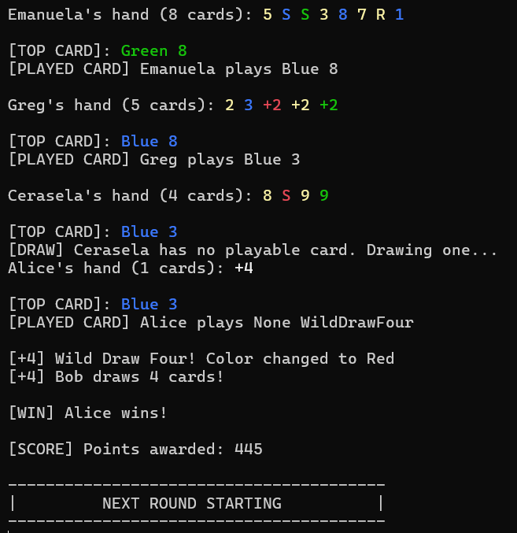

# UNO Game in C#

A console-based UNO card game implementation in C#, supporting single rounds and tournaments with multiple players.
The game includes card effects, scoring, and tournament logic.

---

## Features

- **Multi-player support:** Play with 2–10 players.
- **UNO deck management:**
  - Standard UNO deck with numbers, colors, and action cards.
  - Draw pile and discard pile logic.
- **Card types and effects:**
  - Number Cards (0–9): Regular cards.
  - Skip Turn: Skips the next player's turn.
  - Reverse Order: Reverses the direction of play.
  - Draw Two Cards: Next player draws two cards.
  - Wild Card: Change the color in play.
  - Wild Draw Four: Change the color and make the next player draw four cards.
- **Player hand management:**
  - Display hand with color-coded cards in console.
  - Play cards that match either color or number.
  - Draw a card if no playable card exists.
- **Round logic:**
  - Plays a single round until a player wins or the deck runs out.
  - Handles card effects via `CardEffectManager`.
  - Determines winners by lowest cards if no player clears hand.
- **Tournament mode:**
  - Multiple rounds until a player reaches 600 points.
  - Scores awarded based on remaining cards in opponents’ hands.
  - Tracks cumulative scores using `ScoreManager`.
- **Console interface:**
  - Displays top card and player hand.
  - Shows actions like draws, skips, and color changes.
  - Prints current scores and tournament winner.

## Classes Overview

- **Game**: Handles tournament mode and overall flow.
- **Round**: Handles a single round, player turns, and card effects.
- **CardEffectManager**: Applies card effects like Skip, Reverse, Draw Two, Wild, and Wild Draw Four.
- **ScoreManager**: Tracks scores and determines match winners.
- **Player**: Manages player hand and actions.
- **Deck & Card**: Represents the UNO deck and individual cards.

---

